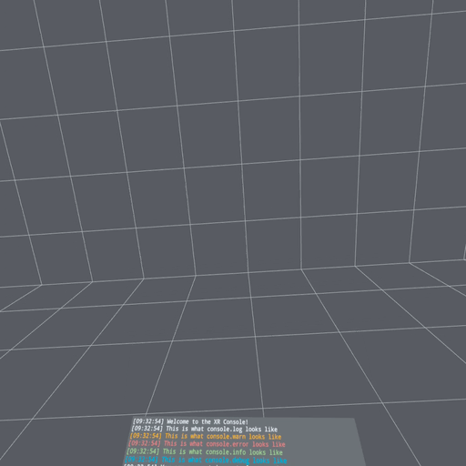

# LogXR

[](https://badge.fury.io/js/logxr)
[](https://www.typescriptlang.org/)
[](https://www.npmjs.com/package/logxr)
[](/LICENSE.md)

A debugging utility that makes it easy to view console logs in WebXR experiences. LogXR provides developers with a simple and straightforward way to debug and troubleshoot their WebXR applications, giving them clarity and insight into the console output. The library is designed to be lightweight and versatile, offering a wide range of customization options for the appearance and behavior of the XR console. Currently, LogXR only supports Three.js, with support for Babylon.js coming soon.



## Features

- 💻 **Familiar API:** No need to learn a new logging API. After setting up LogXR, developers can continue using the familiar `console` API for logging, and their logs will be displayed both in the browser dev console and in the XR console.
- 💬 **Supports Multiple Console Methods:** LogXR currently supports the following console APIs: `console.log`, `console.warn`, `console.error`, `console.info`, and `console.debug`.
- 💨 **Lightweight and Versatile:** LogXR's lightweight design and lack of predefined XR interactions for controlling the console make it easy to integrate into any WebXR project. This versatility gives developers complete control over how they configure and use the XR console, making it highly adaptable to their specific needs.
- 🎨 **Customizable Appearance:** LogXR provides a wide range of options for customizing the appearance and behavior of the XR console, including the ability to set the background color, colors for different types of logging, and the size and resolution of the console panel.

## Demo App

A demo app has been built using Three.js to showcase LogXR in action. You can check out the demo app at https://felixtrz.github.io/logxr/ to see how LogXR works and to get a feel for its capabilities.

This demo app is a great resource for developers who are considering using LogXR in their projects. It provides a hands-on experience with the library, and will give you a better understanding of how it works and what it can do.

## Installation

To install LogXR, simply run the following command in your terminal:

```sh
npm install logxr
```

Or if you prefer using Yarn:

```sh
$ yarn add logxr
```

## Usage

Using LogXR is simple. First, import the package in your WebXR project:

```js
import { XRConsoleFactory } from 'logxr';
```

Then, create an instance of the XR console:

```js
const xrConsole = XRConsoleFactory.getInstance().createConsole({
	pixelWidth: 1024,
	pixelHeight: 512,
	actualWidth: 2,
	actualHeight: 1,
});
```

The xrConsole object created extends [THREE.Object3D](https://threejs.org/docs/#api/en/core/Object3D), and can be used as such. After a console is set up, simply use console.log() as usual, and the logs will be intercepted and reflected on the xrConsole.

## API Reference

The following classes are exported by LogXR, and are available for use in your WebXR projects:

## XRConsoleFactory

The XRConsoleFactory class provides a factory method to create instances of XRConsole, and manage the message queue that all instances of XRConsole read from.

### `static getInstance(): XRConsoleFactory`

```js
static getInstance(): XRConsoleFactory
```

Gets a singleton instance of the XRConsoleFactory.

### `createConsole(options: XRConsoleOptions): XRConsole`

```js
createConsole(options: XRConsoleOptions): XRConsole
```

Creates a new instance of XRConsole with the specified options.

### `getMessages(messageTypes: MessageType[], count: number): Message[]`

```js
getMessages(messageTypes: MessageType[], count: number): Message[]

```

Gets the messages in the message queue that match the specified message types. The number of messages returned is limited by the `count` parameter.

## XRConsole

The `XRConsole` class represents the XR console and provides the necessary functionality for rendering console logs in a WebXR environment.

### Properties

#### `panelMesh: Mesh`

The `panelMesh` property represents the mesh object that serves as the panel for the console.

#### `needsUpdate: boolean`

The `needsUpdate` property is a flag that indicates whether the console canvas needs to be updated.

### Methods

#### `constructor(options?: XRConsoleOptions)`

```js
constructor(options?: XRConsoleOptions)
```

Creates a new instance of the XR console with the specified options.

#### `render()`

```js
render(): void
```

Renders the console to the canvas.

## `XRConsoleOptions`

The `XRConsoleOptions` interface represents a set of options that can be passed to the `XRConsole` constructor to customize its appearance and behavior.

### Properties

- `pixelWidth?: number`: The width of the canvas in pixels. Default is 1024.
- `pixelHeight?: number`: The height of the canvas in pixels. Default is 512.
- `actualWidth?: number`: The width of the plane in meters. Default is 1.
- `actualHeight?: number`: The height of the plane in meters. Default is 1.
- `fontSize?: number`: The font size of the text in pixels. Default is 16.
- `horizontalPadding?: number`: The horizontal padding of the text in pixels. Default is 5.
- `verticalPadding?: number`: The vertical padding of the text in pixels. Default is 5.
- `showTimestamp?: boolean`: Whether or not to show the timestamp. Default is true.
- `messageType?: MessageType`: The type of messages to show. Default is `MessageType.All`.
- `backgroundColor?: string`: The background color of the canvas. Default is `'#222222'`.
- `logColor?: string`: The color of the log messages. Default is `'#FFFFFF'`.
- `errorColor?: string`: The color of the error messages. Default is `'#D0342C'`.
- `warningColor?: string`: The color of the warning messages. Default is `'#FF7900'`.
- `infoColor?: string`: The color of the info messages. Default is `'#76B947'`.
- `debugColor?: string`: The color of the debug messages. Default is `'#0E86D4'`.

## `MessageType`

The `MessageType` enumeration is used to specify the type of messages that should be displayed in the XR console.

### Values

- `All`: Displays all messages.
- `Log`: Displays only log messages.
- `Error`: Displays only error messages.
- `Warning`: Displays only warning messages.
- `Info`: Displays only info messages.
- `Debug`: Displays only debug messages.

## License

[MIT License](/LICENSE.md) © 2023 Felix Zhang
